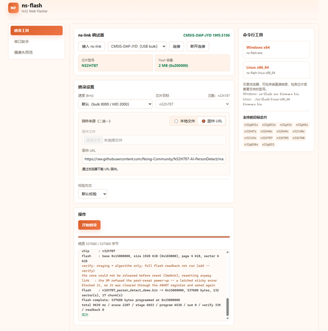
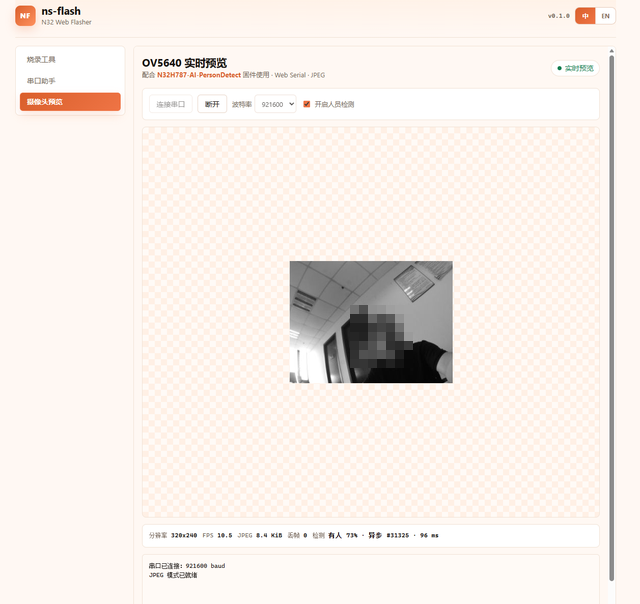

[简体中文](README.md) | **English**

# N32H787 AI Person Detection DEMO

A trimmed-down template project that runs a TensorFlow Lite Micro int8 model on-device — using an N32H787 dual-core MCU and an OV5640 camera — to decide in real time whether a **person is present** in the frame, and report the result over UART and an indicator LED.

## Flash in Your Browser

No toolchain installation required. Open the link below in Chrome/Edge to flash the firmware straight to the N32H787 through an NSLink debugger:

**[Flash N32H787 AI Person Detection DEMO in your browser](https://update.nationstech.com/ns-flash/?target=n32h787&firmware=https%3A%2F%2Fraw.githubusercontent.com%2FNsing-Community%2FN32H787-AI-PersonDetect%2Fmain%2Fbin%2Fn32h787_person_detect_demo.bin&lang=en)**

> Before flashing, connect the NSLink via **DEBUG USB (J9)** and make sure the OV5640 module is seated in the **DVP2** socket.

**Flashing steps**

1. Click **Select ns-link**, pick your device in the dropdown at the top left, then click **Connect** — the chip model (N32H787) and Flash size (2 MB) are detected automatically once connected.
2. Choose a **firmware source** (one of the two): **Firmware URL** is the prebuilt firmware, with the link already filled in — just use it as is; **Local file** is for flashing your own build — click **Choose file** and load the `.bin`.
3. Pick a **verification** — the default is fine.
4. Click **Start flashing** and wait for the progress bar to finish; the log below shows "成功" (success) once the flash is complete.



5. Once flashing has finished, click **Camera preview** in the left sidebar, then in the **OV5640 live preview** panel click **Connect serial** — baud rate 921600 — and tick **Enable person detection**. The live camera image and the detection result then appear directly in the browser: the status bar at the bottom shows the resolution, frame rate, JPEG size and dropped-frame count, along with the verdict (e.g. "person 73%") and the inference time.



## Overview

This project is a binary "person / no-person" detection template: one core continuously captures camera frames and serves stream requests from the host, while the other core runs neural-network inference asynchronously in the background. The two cores exchange frames and detection results through shared memory and never block each other. The output is a confidence score for each of the person / no-person classes — no face-box localization or identity recognition — making it a convenient starting point for access-control wake-up, presence sensing, face-gate and similar applications.

## Hardware Platform

- **MCU**: N32H787 (Cortex-M7 @ 600 MHz + Cortex-M4 dual core, with FPU)
- **Board**: Nsing Technologies official development board **N32H787\_HMI\_V1.1**
- **Camera**: OV5640 (DVP parallel interface, outputs QVGA 320×240 Y8 grayscale)
- **Peripherals**: USB (NSLink virtual COM port, USART1 921600 8N1), on-chip Flash/SRAM, external 32 MB SDRAM, on-chip hardware JPEG encoder, GPIO indicator LEDs (PB3 lights at low level to indicate "person present"; PI8 is the run heartbeat LED)

**Board photo (N32H787\_HMI\_V1.1)**: the board has two 2×9 DVP camera sockets along its edge, silkscreened **DVP1** and **DVP2**. This project's OV5640 module plugs into **DVP2** (see "Camera Wiring" below for the exact pinout). The debug UART is brought out by the on-board NSLink through **DEBUG USB (J9)**.


### Camera Wiring

The camera module is a **T-OV5640-PCB-V1.0** (OV5640 sensor, 3.6 mm lens, on-board 24 MHz crystal, 2×9 pin header). Seat the header directly into the **DVP2** socket on the board edge — no jumper wires needed — and leave the yellow **DVP1** socket next to it empty. Connect the USB cable to **DEBUG USB (J9)**, which provides power, flashing and the virtual COM port for streaming all at once:


The signals are silkscreened next to the module's two pin rows:


**2×9 pin header signal order (counting from the 3V3/GND end, matching the on-board DVP sockets pin for pin)**

| Pin | Signal | Pin | Signal | Notes |
|:---:|:---|:---:|:---|:---|
| 1 | 3V3 | 2 | GND | 3.3 V supply — never connect 5 V |
| 3 | VS (VSYNC) | 4 | SCL | Vertical sync / SCCB clock |
| 5 | HS (HSYNC) | 6 | SDA | Horizontal sync / SCCB data |
| 7 | RST | 8 | D0 | Reset (active low) / data bit 0 |
| 9 | D1 | 10 | D2 | Data bit 1 / data bit 2 |
| 11 | D3 | 12 | D4 | Data bit 3 / data bit 4 |
| 13 | D5 | 14 | D6 | Data bit 5 / data bit 6 |
| 15 | D7 | 16 | PCLK | Data bit 7 / pixel clock |
| 17 | NC | 18 | PWDN | No external MCLK (module has its own crystal) / power-down, pulled down by 4.7 kΩ on the board to stay permanently enabled |

**DVP2 socket to MCU pin mapping (i.e. what this firmware actually configures)**

| Signal | MCU pin | Signal | MCU pin |
|:---|:---|:---|:---|
| D0 / D1 | PE2 / PE3 | D2 / D3 | PK5 / PK6 |
| D4 / D5 | PI14 / PK2 | D6 / D7 | PK1 / PC3 |
| VSYNC / HSYNC | PF9 / PH4 | PCLK | PH5 |
| SCL / SDA | PD12 / PD13 (I2C4) | RST | PG6 |
| SCCB slave address | 0x3C (7 bit) | PWDN | not managed by firmware (hardware pull-down keeps it enabled) |

> **Note: do not plug the module into DVP1.** DVP1 (J61) and DVP2 have identical socket shape and identical 2×9 signal order, and the same module fits either one — but the two sockets are wired to different MCU pins. DVP1 uses VSYNC=PB7, HSYNC=PA4, RST=PC13, D0\~D7=PC6/PC7/PB13/PG11/PE4/PB6/PE5/PE6, PCLK=PA6. This firmware only initializes and drives **DVP2**; if the module is mistakenly inserted into DVP1, SCCB may still acknowledge but no image will come out. Only SCL/SDA (PD12/PD13) are shared between the two sockets.

The schematic below shows the on-board **DVP2 (J1)** — the connection this project actually uses — and can be checked against the table above pin by pin. The 3.3 V rail has a 0.1 µF decoupling capacitor (C35), and PWDN is pulled down through a 4.7 kΩ resistor (R11) to stay permanently enabled:


### Dual-Core Architecture

- **M7 (primary core)**: chip initialization and **neural-network inference**. It boots and monitors the M4, takes snapshots from the shared frame buffer, performs preprocessing and person/no-person classification, and writes the result back to shared memory.
- **M4 (secondary core)**: **camera capture and communication**. It drives the OV5640 to grab grayscale frames, performs hardware JPEG compression, handles the UART frame-request commands, and drives the PB3 indicator LED according to the detection result.
- **Sharing and handshake**: the two cores exchange data through a shared structure in on-chip SRAM — the M7 publishes a frame-request ticket, the M4 answers once the frame is ready, and the M7 releases it after copying it out. Detection results are published with a sequence number and a memory barrier, so an asynchronous reader always gets the conclusion for one complete frame. While the M7 is inferring, the M4 keeps streaming images; neither waits for the other.

## How It Works (Person Detection Pipeline)

"Deciding whether there is a person in the frame" is implemented as the following pipeline:

1. **Capture**: the M4 grabs one 320×240 Y8 grayscale frame from the OV5640 over the DVP interface and writes it into the frame buffer.
2. **Downscale for the other core**: the M4 applies 2× neighborhood averaging to downsample the frame to 160×120 and places it in the dual-core shared buffer for the M7 (without interrupting the ongoing stream).
3. **Crop**: the model accepts square input only, so the M7 takes the largest 120×120 square at the center of the frame (preserving aspect ratio — no stretching or distortion).
4. **Resize and quantize**: box-average resize to the **96×96** the model requires, then use the model's int8 quantization parameters to convert 0\~255 luminance into int8 input.
5. **Inference**: TensorFlow Lite Micro runs the MobileNet binary classification network on the M7 (accelerated by CMSIS-NN), producing a score for each of the person and no-person classes.
6. **Decision and output**: the two scores are compared; if "person" wins, a **person is present** — the M4 lights the PB3 LED. When the host requests a frame, the conclusion (scores, frame number, result age, per-stage timings) is sent back along with the frame header, and [capture\_ov5640.py](tools/capture_ov5640.py) overlays the PERSON percentage on the image.

The whole pipeline is **asynchronous**: the UART image is always the most recently captured frame, while the overlaid detection conclusion may come from a frame several hundred milliseconds old. The "result age" in the frame header tells you exactly how fresh that conclusion is.

### Results in Action

The host previews the live captured image (faces in the image are blurred). The status bar at the bottom shows the frame rate, frame size, dropped-frame count, and the M7 timings for inference (infer), preprocessing (prep) and frame copy (copy); `0.1s old` means the conclusion comes from an inference run 0.1 s ago.

**① Person detected**: the status line turns green and shows `Async PERSON 93%`.


**② No person in frame**: the status line is gray and shows `Async none 56%`; the PB3 LED is off.


## Repository Layout

```
n32h787_person_detect_demo/
├── firmware/
│   ├── CM4/                  # M4 secondary core: camera capture + UART protocol
│   │   ├── src/main.c        #   M4 entry point and shared-memory service
│   │   ├── src/camera_app.c  #   capture main loop, OV56 protocol, result LED
│   │   └── image.s           #   embeds the M4 bin into the single M7 image
│   ├── USER/                 # M7 primary core + code shared by both cores
│   │   ├── inc/              #   headers (incl. the shared mailbox m4_shared.h)
│   │   ├── src/
│   │   │   ├── main.c                # M7 entry point and async inference loop
│   │   │   ├── person_detector.cc    # TFLM interpreter wrapper
│   │   │   ├── person_preprocess.c   # center crop + resize to 96×96
│   │   │   ├── person_model_data.cc  # generated automatically from the .tflite
│   │   │   ├── m4_boot.c             # M4 boot and monitoring
│   │   │   ├── ov5640.c              # OV5640 configuration
│   │   │   ├── jpeg_encoder.c        # hardware JPEG encoding
│   │   │   └── n32h7xx_cfg.c         # clock/GPIO/I2C/USART/DVP configuration
│   │   └── tflm_sdk/                 # TFLM headers + prebuilt CMSIS-NN library
│   ├── Driver/               # CMSIS, startup files, standard peripheral drivers
│   ├── Makefile/             # Makefile, build.cmd, linker scripts, build output
│   └── openocd/              # flash config and Flash algorithms (detailed README inside)
├── models/
│   └── person_detect.tflite  # person detection model (~294 KiB)
├── tools/
│   ├── capture_ov5640.py     # host-side frame grabber: preview/snapshot/benchmark
│   └── embed_tflite.py       # converts .tflite to a C++ array (called by the build)
├── docs/
│   └── images/               # README images: board/wiring, pinout, DVP schematic, screenshots
└── README.md
```

## AI Model

- **Model**: the official TFLM person\_detection model (MobileNetV1 0.25), input 1×96×96×1, two output classes person / no-person; see [person\_detect.tflite](models/person_detect.tflite) (~294 KiB).
- **Quantization**: fully **int8**; a score can be read as a probability via `(score+128)/256`. At runtime only the 5 operators the network uses are registered (Conv2D / DepthwiseConv2D / AveragePool2D / Reshape / Softmax), with a 136 KB Tensor arena.
- **Performance**: measured on the M7 @ 600 MHz, a single inference (Invoke) takes about **26 ms**, preprocessing about 0.7 ms and frame copy about 0.2 ms. End-to-end frame rate is limited mainly by the streaming link (measured JPEG preview ≈ 12 FPS). You can re-measure over more samples with `make benchmark` or the host tool's `--benchmark --profile`.
- **Swapping the model**: replace `models/person_detect.tflite` and rebuild — the model array is regenerated automatically. If the input size or quantization parameters differ, also update `PERSON_INPUT_SIDE` in [person\_preprocess.h](firmware/USER/inc/person_preprocess.h) and the shape checks in [person\_detector.cc](firmware/USER/src/person_detector.cc).

## Dependencies

- **Toolchain**: N32Studio (bundles ARM GCC `arm-none-eabi-`, a make environment and OpenOCD; installed by default under `%USERPROFILE%\.n32studio`). The build entry point [build.cmd](firmware/Makefile/build.cmd) locates the toolchain itself and provides make/sh through Git for Windows — it does not modify the system PATH.
- **Python**: 3.10+ (the build uses the standard library only; the host tool additionally needs the packages below)

```bat
pip install opencv-python pyserial numpy
```

## Building and Flashing (Windows)

Run these from the `firmware\Makefile` directory:

```bat
build.cmd              :: build, producing build\n32h787_person_detect_demo.elf/.hex/.bin (single M7+M4 image)
build.cmd release=y    :: release build without debug info
build.cmd cm4          :: build the M4 image only
build.cmd clean        :: clean the build directory
build.cmd flash        :: build and flash to 0x15000000 via NSLink (no bootloader, runs on power-up)
```

The M4 image is compiled first and embedded into the M7 image, so a single flash programs both cores (M7 at 0x15000000, M4 at 0x15080000; the M7 starts the M4 after power-up). For the flash algorithm and SWD caveats, see [firmware/openocd/README.md](firmware/openocd/README.md).

## Using the Host Tool

Once the NSLink enumerates as a virtual COM port (the port is auto-detected by VID/PID):

```bat
python tools\capture_ov5640.py                 :: live preview (JPEG + detection on by default; q/Esc to quit, s to snapshot)
python tools\capture_ov5640.py --single        :: grab one frame, save it and exit
python tools\capture_ov5640.py --no-person     :: disable inference, view the image only
python tools\capture_ov5640.py --benchmark 100 :: capture 100 frames and measure throughput
python tools\capture_ov5640.py --list-ports    :: list available serial ports
```

Firmware UART commands: `C` grabs one frame, `N` toggles person detection, `J` toggles JPEG; each returns an ASCII acknowledgement. The baud rate is fixed at 921600 — if it does not match the host, the link will be **silent, with no data**. Protocol details are in the header comment of [capture\_ov5640.py](tools/capture_ov5640.py).

## License

This project is released under the **BSD 3-Clause License**; the full license text is in [LICENSE](LICENSE).

**Scope**: that BSD-3-Clause declaration applies only to code for which NSING holds the complete copyright, or has obtained the necessary authorisation and the right to publish under BSD-3-Clause. Where this project contains third-party code, its original copyright notice and license continue to apply — the NSING copyright and the BSD-3-Clause declaration do **not** cover it, and its use, modification and distribution remain governed by its own license.

- Attribution and licensing for third-party components (CMSIS, TensorFlow Lite Micro, CMSIS-NN, FlatBuffers, gemmlowp, ruy, KissFFT, Zephyr-derived code and the detection model) is in [NOTICE](NOTICE); their respective license texts ship alongside the source (e.g. the LICENSE under `firmware/USER/tflm_sdk/`, and KissFFT's COPYING). Please keep them when redistributing.
- **Trademark notice**: Nations, Nationstech, N32, N32H787 and the Nations Technologies logo are trademarks of Nsing Technologies Inc. The BSD-3-Clause license does not grant trademark rights.
