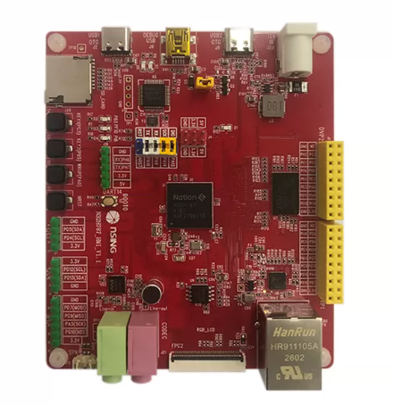
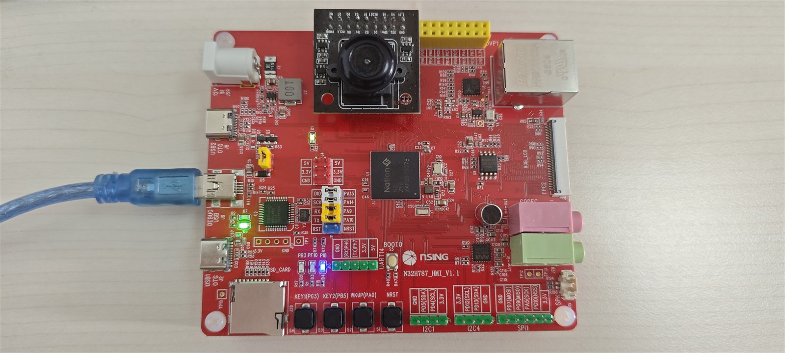
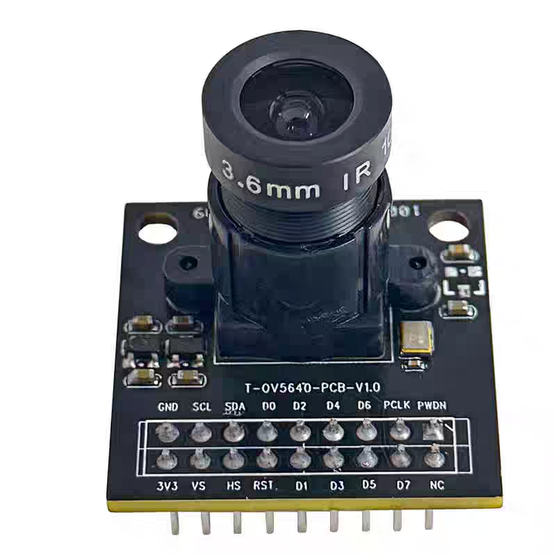
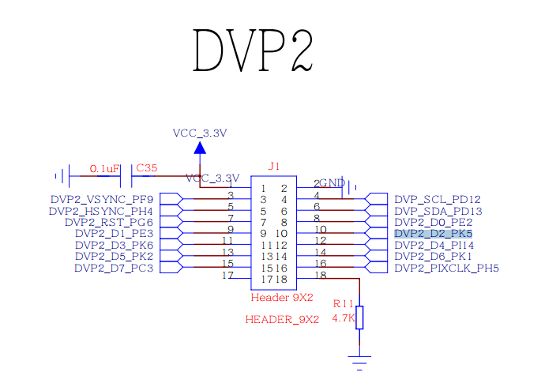
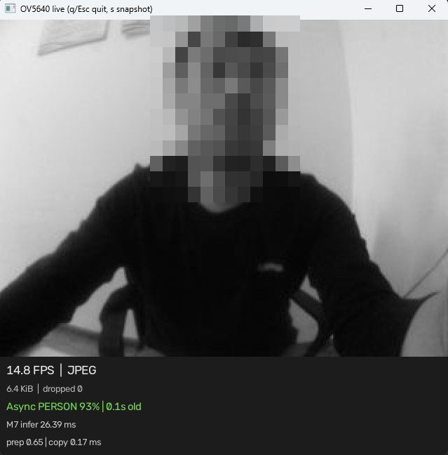
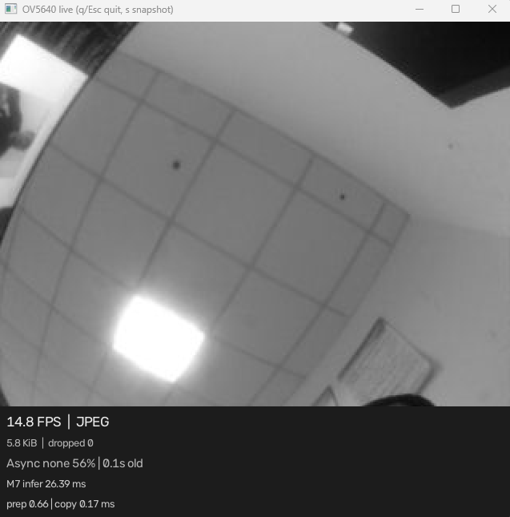

# N32H787 人体存在检测 DEMO

基于 N32H787 双核 MCU 与 OV5640 摄像头、在端侧运行 TensorFlow Lite Micro int8 模型，实时判断画面中**是否有人**并通过串口与指示灯输出结果的裁剪模板工程。

## 在线烧录

无需安装工具链，使用 Chrome/Edge 打开以下链接，通过 NSLink 调试器将固件直接烧录到 N32H787：

**[在线烧录 N32H787 人体存在检测 DEMO](https://update.nationstech.com/ns-flash/?target=n32h787&firmware=https%3A%2F%2Fraw.githubusercontent.com%2FNsing-Community%2FN32H787-AI-PersonDetect%2Fmain%2Fbin%2Fn32h787_person_detect_demo.bin)**

> 烧录前请通过 **DEBUG USB（J9）** 连接 NSLink，并确认 OV5640 已插入 **DVP2** 座。

## 简介

本工程是一个"是否有人"的二分类检测模板：一核持续采集摄像头画面并响应上位机取流，另一核在后台异步执行神经网络推理，两核通过共享内存交换帧和检测结果，互不阻塞。输出为 person / no-person 两类置信度，不做人脸框定位或身份识别，适合作为门禁唤醒、存在感应、人脸闸机等应用的起点。

## 硬件平台

- **MCU**: N32H787（Cortex-M7 @ 600 MHz + Cortex-M4 双核，带 FPU）
- **开发板**: 国民技术官方开发板 **N32H787\_HMI\_V1.1**
- **摄像头**: OV5640（DVP 并行接口，输出 QVGA 320×240 Y8 灰度）
- **外设**: USB（NSLink 虚拟串口，USART1 921600 8N1）、片上 Flash/SRAM、外挂 32 MB SDRAM、片内 JPEG 硬件编码器、GPIO 指示灯（PB3 低电平点亮表示"有人"，PI8 为运行心跳灯）

**开发板实物图（N32H787\_HMI\_V1.1）**：板边有两个 2×9 的 DVP 摄像头座，丝印分别为 **DVP1**、**DVP2**；本工程的 OV5640 模块插在 **DVP2** 座（具体接法见下文"摄像头接线"）。调试串口由板载 NSLink 经 **DEBUG USB（J9）** 引出。



### 摄像头接线

摄像头模块为 **T-OV5640-PCB-V1.0**（OV5640 芯片、3.6 mm 镜头、板载 24 MHz 晶振、2×9 排针）。将排针对准板边的 **DVP2** 座直接插入即可，无需杜邦线，旁边的黄色 **DVP1** 座保持空置；USB 线接 **DEBUG USB（J9）**，同时完成供电、烧录与虚拟串口取流：



模块两排排针旁印有信号丝印：



**2×9 排针信号顺序（自 3V3/GND 端数起，与板上 DVP 座针位一一对应）**

| 针号 | 信号 | 针号 | 信号 | 说明 |
|:---:|:---|:---:|:---|:---|
| 1 | 3V3 | 2 | GND | 3.3 V 供电，切勿接 5 V |
| 3 | VS（VSYNC） | 4 | SCL | 场同步 / SCCB 时钟 |
| 5 | HS（HSYNC） | 6 | SDA | 行同步 / SCCB 数据 |
| 7 | RST | 8 | D0 | 复位（低电平有效）/ 数据位 0 |
| 9 | D1 | 10 | D2 | 数据位 1 / 数据位 2 |
| 11 | D3 | 12 | D4 | 数据位 3 / 数据位 4 |
| 13 | D5 | 14 | D6 | 数据位 5 / 数据位 6 |
| 15 | D7 | 16 | PCLK | 数据位 7 / 像素时钟 |
| 17 | NC | 18 | PWDN | 不接外部 MCLK（模块自带晶振）/ 掉电脚，板上 4.7 kΩ 下拉保持常使能 |

**DVP2 座到 MCU 引脚的连接（即本工程固件的实际配置）**

| 信号 | MCU 引脚 | 信号 | MCU 引脚 |
|:---|:---|:---|:---|
| D0 / D1 | PE2 / PE3 | D2 / D3 | PK5 / PK6 |
| D4 / D5 | PI14 / PK2 | D6 / D7 | PK1 / PC3 |
| VSYNC / HSYNC | PF9 / PH4 | PCLK | PH5 |
| SCL / SDA | PD12 / PD13（I2C4） | RST | PG6 |
| SCCB 从地址 | 0x3C（7 bit） | PWDN | 固件不管理（硬件下拉常使能） |

> **注意：不要插到 DVP1。** DVP1（J61）与 DVP2 的座孔外形、2×9 信号顺序完全相同，同一只模块两个座都能插入，但两口连到 MCU 的引脚不同——DVP1 为 VSYNC=PB7、HSYNC=PA4、RST=PC13、D0\~D7=PC6/PC7/PB13/PG11/PE4/PB6/PE5/PE6、PCLK=PA6。本工程固件只初始化并驱动 **DVP2** 外设，误插 DVP1 时 SCCB 可能有应答但不会出图像；仅 SCL/SDA（PD12/PD13）为两口共用。

下图为板载 **DVP2（J1）** 的原理图，即本工程实际使用的连接，可与上表逐针对照；3.3 V 电源带 0.1 µF 去耦电容（C35），PWDN 经 4.7 kΩ 电阻（R11）下拉保持常使能：



### 双核说明

- **M7（主核）**：芯片初始化与**神经网络推理**。启动并监控 M4，从共享帧缓冲取快照，完成预处理和 person/no-person 分类，把结果写回共享内存。
- **M4（辅核）**：**摄像头采集与通信**。驱动 OV5640 抓拍灰度帧、做硬件 JPEG 压缩、处理串口取帧命令、按检测结果点亮 PB3 指示灯。
- **共享与通信**：两核通过片上 SRAM 中的共享结构体交换数据——M7 发出帧请求票号，M4 备好帧后应答，M7 拷贝走即释放；检测结果带序号发布并配内存屏障，保证异步读到的总是完整一帧的结论。M7 推理期间 M4 照常出图，互不等待。

## 功能（人体识别实现流程）

"判断画面里有没有人"按以下流水线实现：

1. **采集**：M4 通过 DVP 接口从 OV5640 抓取一帧 320×240 的 Y8 灰度图，写入帧缓冲。
2. **缩小送核**：M4 对该帧做 2× 邻域平均，下采样成 160×120，放入双核共享缓冲区供 M7 使用（不影响继续出图）。
3. **裁剪**：模型只接受正方形输入，M7 取画面正中最大的 120×120 方块（保持宽高比，不拉伸变形）。
4. **缩放与量化**：盒式平均缩放到模型要求的 **96×96**，再按模型的 int8 量化参数查表，把 0\~255 亮度转成 int8 输入。
5. **推理**：TensorFlow Lite Micro 在 M7 上执行 MobileNet 二分类网络（CMSIS-NN 加速），输出 person、no-person 两个分值。
6. **判决与输出**：比较两类分值，"person"胜出即判定**有人**——M4 点亮 PB3 指示灯；上位机取帧时，结论（分值、帧号、结果龄期、各阶段耗时）随帧头一起回传，由 [capture\_ov5640.py](tools/capture_ov5640.py) 在画面上叠加显示 PERSON 百分比。

整个流程是**异步**的：串口画面始终是最新抓拍帧，叠加的识别结论可能来自几百毫秒前的一帧，帧头中的"结果龄期"即标明该结论的新旧。

### 运行效果

上位机实时预览实测画面（画面人脸已打码）。底部状态栏给出帧率、帧大小、丢帧数，以及 M7 推理（infer）、预处理（prep）、帧拷贝（copy）耗时；`0.1s old` 表示该结论来自 0.1 秒前的推理帧。

**① 检测到有人**：状态行变绿，显示 `Async PERSON 93%`。



**② 画面中无人**：状态行为灰色，显示 `Async none 56%`，PB3 指示灯熄灭。



## 目录结构

```
n32h787_person_detect_demo/
├── firmware/
│   ├── CM4/                  # M4 辅核应用：摄像头采集 + 串口协议
│   │   ├── src/main.c        #   M4 入口与共享内存服务
│   │   ├── src/camera_app.c  #   采集主循环、OV56 协议、结果灯
│   │   └── image.s           #   把 M4 bin 嵌入 M7 单一镜像
│   ├── USER/                 # M7 主核应用与双核共用代码
│   │   ├── inc/              #   头文件（含共享邮箱 m4_shared.h）
│   │   ├── src/
│   │   │   ├── main.c                # M7 入口与异步推理循环
│   │   │   ├── person_detector.cc    # TFLM 解释器封装
│   │   │   ├── person_preprocess.c   # 中心裁剪 + 缩放到 96×96
│   │   │   ├── person_model_data.cc  # 由 .tflite 自动生成
│   │   │   ├── m4_boot.c             # M4 启动与监控
│   │   │   ├── ov5640.c              # OV5640 配置
│   │   │   ├── jpeg_encoder.c        # 硬件 JPEG 编码
│   │   │   └── n32h7xx_cfg.c         # 时钟/GPIO/I2C/USART/DVP 配置
│   │   └── tflm_sdk/                 # TFLM 头文件 + 预编译 CMSIS-NN 库
│   ├── Driver/               # CMSIS、启动文件、标准外设驱动
│   ├── Makefile/             # Makefile、build.cmd、链接脚本、构建产物
│   └── openocd/              # 烧录配置与 Flash 算法（内含详细 README）
├── models/
│   └── person_detect.tflite  # 人体存在检测模型（约 294 KiB）
├── tools/
│   ├── capture_ov5640.py     # 串口取帧上位机：预览/抓拍/性能测试
│   └── embed_tflite.py       # 把 .tflite 转成 C++ 数组（构建自动调用）
├── docs/
│   └── images/               # README 配图：板卡/接线实物、模块引脚、DVP 原理图、实测截图
└── README.md
```

## AI 模型说明

- **模型**：TFLM 官方 person\_detection 模型（MobileNetV1 0.25），输入 1×96×96×1，输出 person / no-person 两类，文件见 [person\_detect.tflite](models/person_detect.tflite)（约 294 KiB）。
- **量化**：全 **int8**，输出分值按 `(score+128)/256` 即可读成概率；运行时只注册网络用到的 5 个算子（Conv2D / DepthwiseConv2D / AveragePool2D / Reshape / Softmax），Tensor arena 136 KB。
- **性能**：M7 @ 600 MHz 实测单次推理（Invoke）约 **26 ms**，预处理约 0.7 ms、帧拷贝约 0.2 ms；端到端帧率主要受取流链路限制（实测 JPEG 预览约 12 FPS）。更多样本可用 `make benchmark` 或上位机 `--benchmark --profile` 复测。
- **换模型**：替换 `models/person_detect.tflite` 后重新构建即可自动重新生成模型数组；若输入尺寸或量化参数不同，需同步修改 [person\_preprocess.h](firmware/USER/inc/person_preprocess.h) 的 `PERSON_INPUT_SIDE` 与 [person\_detector.cc](firmware/USER/src/person_detector.cc) 中的形状校验。

## 环境依赖

- **工具链**：N32Studio（自带 ARM GCC `arm-none-eabi-`、make 环境与 OpenOCD，默认安装在 `%USERPROFILE%\.n32studio`）；构建入口 [build.cmd](firmware/Makefile/build.cmd) 会自行定位工具链并通过 Git for Windows 提供 make/sh，不修改系统 PATH
- **Python**：3.10+（构建时仅用标准库；上位机另需以下依赖）

```bat
pip install opencv-python pyserial numpy
```

## 编译/构建/烧录方式（Windows）

在 `firmware\Makefile` 目录下执行：

```bat
build.cmd              :: 构建，产出 build\n32h787_person_detect_demo.elf/.hex/.bin（M7+M4 单一镜像）
build.cmd release=y    :: 无调试信息的 release 构建
build.cmd cm4          :: 只构建 M4 镜像
build.cmd clean        :: 清理 build 目录
build.cmd flash        :: 构建并经 NSLink 烧录到 0x15000000（无 Bootloader，上电直跑）
```

M4 镜像会先被编译并嵌入 M7 镜像，一次烧录即完成双核编程（M7 位于 0x15000000，M4 位于 0x15080000，上电后 M7 负责启动 M4）。烧录算法与 SWD 注意事项详见 [firmware/openocd/README.md](firmware/openocd/README.md)。

## 上位机使用

NSLink 枚举为虚拟串口后（按 VID/PID 自动识别 COM 口）：

```bat
python tools\capture_ov5640.py                 :: 实时预览（默认 JPEG + 检测开启；q/Esc 退出，s 抓拍）
python tools\capture_ov5640.py --single        :: 抓一帧保存后退出
python tools\capture_ov5640.py --no-person     :: 关闭推理只看画面
python tools\capture_ov5640.py --benchmark 100 :: 收 100 帧测吞吐
python tools\capture_ov5640.py --list-ports    :: 查看可用串口
```

固件串口命令：`C` 取一帧、`N` 切换人体检测开关、`J` 切换 JPEG 开关，均有 ASCII 应答。波特率固定 921600，与上位机不一致时链路会**静默无数据**；协议格式细节见 [capture\_ov5640.py](tools/capture_ov5640.py) 文件头注释。

## 开源许可

本工程由国民技术股份有限公司（Nations Technologies Inc.）以 **Apache License 2.0** 发布，完整许可文本见 [LICENSE](LICENSE)。每个源文件头均带有 `SPDX-License-Identifier: Apache-2.0` 声明。

- 第三方组件（CMSIS、TensorFlow Lite Micro、CMSIS-NN、FlatBuffers、gemmlowp、ruy、KissFFT、Zephyr 衍生代码及检测模型）的归属见 [NOTICE](NOTICE)，各自许可文本随附在源码目录中（如 `firmware/USER/tflm_sdk/` 下的 LICENSE、KissFFT 的 COPYING），再分发时请一并保留。
- **商标声明**：Nations、Nationstech、N32、N32H787 及国民技术标识为国民技术股份有限公司商标，Apache-2.0 许可不包含商标授权。

